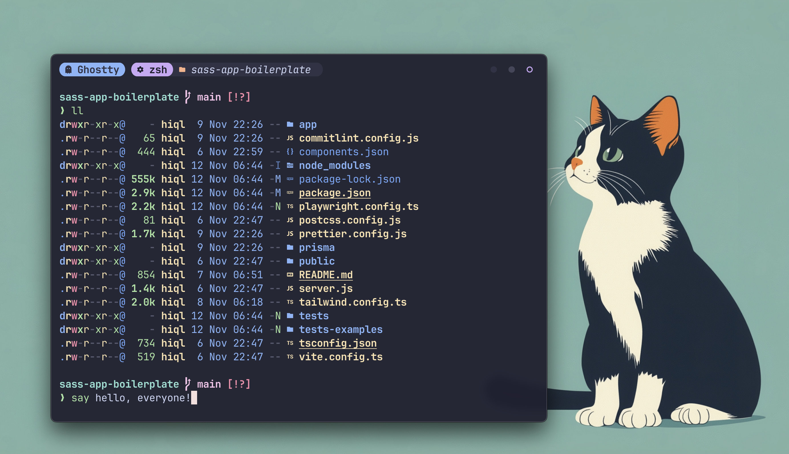

# dotfiles

My personal dotfiles

**Warning**: Don’t blindly use my settings. Just as a reference!



## Install with stow:

```bash
stow .
```

## Apps

- [Ghostty](https://ghostty.org/) - Terminal emulator
- [Yazi](https://yazi-rs.github.io/) - Ranger-like terminal file manager
- System Info
  - [bottom](https://github.com/ClementTsang/bottom) - System monitor for the terminal
  - [nvtop](https://github.com/Syllo/nvtop) - GPU & Accelerator process monitoring
  - [fastfetch](https://github.com/fastfetch-cli/fastfetch) - System information tool
  - [cpufetch](https://github.com/Dr-Noob/cpufetch) - CPU information tool
- Zsh Shell
  - [zsh](https://www.zsh.org) - Shell
  - [zsh-syntax-highlighting](https://github.com/zsh-users/zsh-syntax-highlighting) - Fish shell like syntax highlighting for Zsh
  - [zsh-autosuggestions](https://github.com/zsh-users/zsh-autosuggestions) - Fish-like autosuggestions for zsh
- Editor
  - [neovim](https://neovim.io) - Vim-based text editor
  - [LazyVim](https://www.lazyvim.org) - Neovim config for the lazy
  - [catppuccin](https://github.com/catppuccin/nvim) - Colorscheme for neovim
- Programming Fonts
  - [font-commit-mono-nerd-font](https://commitmono.com/) - Commit Mono
  - [font-jetbrains-mono-nerd-font](https://www.jetbrains.com/lp/mono) - JetBrains Mono font
  - [nerd-fonts](https://github.com/ryanoasis/nerd-fonts) - Nerd Fonts
- Git
  - [git-lfs](https://git-lfs.com) - Git extension for versioning large files
  - [onefetch](https://github.com/o2sh/onefetch) - Git information tool
  - [delta](https://github.com/dandavison/delta) - A syntax-highlighting pager for git, diff, grep, and blame output
  - [ghq](https://github.com/x-motemen/ghq) - Local Git repository organizer
  - [lazygit](https://github.com/jesseduffield/lazygit) - simple terminal UI for git commands
  - [commitizen](https://commitizen-tools.github.io/commitizen) - Create committing rules for projects, auto bump versions, and auto changelog generation
- Others
  - [zoxide](https://github.com/ajeetdsouza/zoxide) - `cd` replacement
  - [eza](https://github.com/eza-community/eza) - `ls` replacement
  - [dust](https://github.com/bootandy/dust) - `du` replacement
  - [duf](https://github.com/muesli/duf) - `df` replacement
  - [procs](https://github.com/dalance/procs) - `ps` replacement
  - [bat](https://github.com/sharkdp/bat) - `cat` replacement
  - [fd](https://github.com/sharkdp/fd) - `find` replacement
  - [gping](https://github.com/orf/gping) - Ping, but with a graph
  - [fzf](https://github.com/junegunn/fzf) - Command-line fuzzy finder
  - [ripgrep](https://github.com/BurntSushi/ripgrep) - Search tool
  - [ast-grep](https://github.com/ast-grep/ast-grep) - Code searching, linting, rewriting
  - [hurl](https://hurl.dev) - Run and test HTTP requests
  - [hyperfine](https://github.com/sharkdp/hyperfine) - Benchmarking tool
  - [tailspin](https://github.com/bensadeh/tailspin) - A log file highlighter
  - [fx](https://fx.wtf) - Terminal JSON viewer
  - [hexyl](https://github.com/sharkdp/hexyl) - A command-line hex viewer
  - [glow](https://github.com/charmbracelet/glow) - Markdown viewer for the terminal
  - [viu](https://github.com/atanunq/viu) - Simple terminal image viewer
  - [exiftool](https://exiftool.org) - Command-line tool for reading and writing EXIF metadata
  - [tldr](https://tldr.sh) - Simplified and community-driven man pages
  - [thefuck](https://github.com/nvbn/thefuck) - Corrects your previous console command
  - [wget](https://www.gnu.org/software/wget/) - Internet file retriever
  - [axel](https://github.com/axel-download-accelerator/axel) - Download accelerator
  - [aria2](https://github.com/aria2/aria2) - Download utility(HTTP/HTTPS, FTP, SFTP, BitTorrent and Metalink)
  - [trash](https://hasseg.org/trash/) - Moves files or folders to the trash(macOS)
  - [unar](https://theunarchiver.com/command-line) - Command-line unarchiving tools supporting multiple formats
  - [jenv](https://www.jenv.be) - Manage your Java environment
  - [bandwhich](https://github.com/imsnif/bandwhich) - Terminal bandwidth utilization tool
  - [tokei](https://github.com/XAMPPRocky/tokei) - Count your code
  - [ctop](https://ctop.sh) - concise commandline monitoring for containers
  - [just](https://just.systems) - Just a command runner
- MacOS
  - [AppCleaner](https://freemacsoft.net/appcleaner) - Uninstall mac apps
  - [IINA](https://iina.io) - Media player
  - [Figma](https://www.figma.com) - Design tool
  - [OrbStack](https://orbstack.dev) - Replacement for Docker Desktop
  - [Windows App](https://aka.ms/WindowsApp) - Connect to Windows
  - [LogSeq](https://logseq.com) - Note-Taking app
  - [Typora](https://typora.io) - Markdown Editor
  - [Xmind](https://www.xmind.net) - Mind mapping and brainstorming tool
  - [Ollama](https://ollama.com) - Create, run, and share large language models (LLMs)
  - [SpaceDrive](https://www.spacedrive.com) - Cross-platform file explorer
